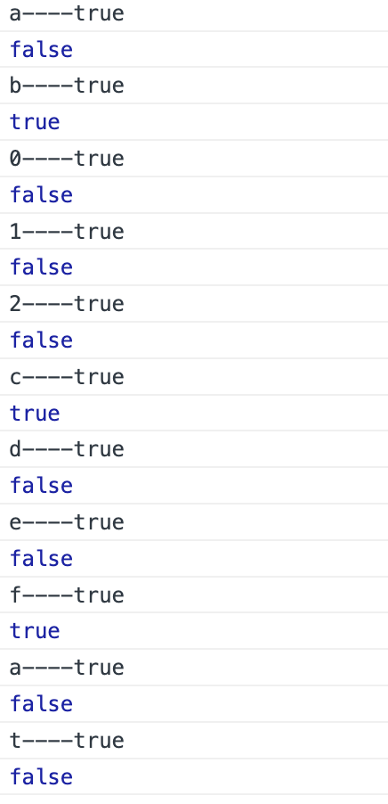
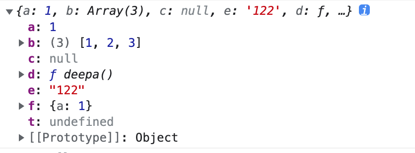

# 1.1 数组
## 1.1.1 什么是数组
 数组的标准定义是: 一个存储元素的线性集合(collection),元素可以通过索引来任意存取,索引通常是数字,用来计算元素之间存储位置的偏移量.几乎所有的编程语言都有类似的数据结构.然后javascript的数组却略有不同.

 javascript是一种特殊的对象,用来表示偏移量的索引是该对象的属性,索引可能是证书.这些数字索引在内部被转化为字符串类型,这是因为javascript对象的属性名必须是字符串.数组在javascript中只是一种特殊的对象,所以效率不如其他语音的数组高.

 javascript中的数组非常灵活.单是创建数组和存取元素的方法就好几种,也可以通过不同方式对数组进行查找和排序.

 ## 1.1.2 创建数组
 ```
 let  numbers1 = []
 我们这样声明了一个长度为0的空数组.可以通过调用内建的length属性来验证这一点.
 console.log(numbers1.length)  // 0

 let numbers2 = [1,2,3,4,5]
 console.log(numbers2.length)  // 5

 let numbers3 = new Array();
 console.log(numbers3.length)  // 0

 let numbers4 = new Array(1,2,3,4,5);
 console.log(numbers4.length)  // 5

 let numbers5 = new Array(10);
 console.log(numbers5.length)  // 10
 console.log(numbers5) 
 
javascript undefined 表示空属性,而不是null ,在代码中初始化定义undefined 为参数,
可以让参数在没有重新赋值的时候,不传递.

 像这样只传入一个参数,用来制定数组的长度.javascript是一种脚本语言,数组中的元素不必是同一种数据类型,
 这一点和很多编程语言不同.

 let objects = [1,‘Joe',true,null];

我们可以使用Arrary.isArray()来判断一个对象是否是数组.

一般我们认为使用字面量的方式创建数组 效率更高 ([])

 ```
 ## 1.1.3 读写数组
  1.循环赋值.
 ```
  let nums = []
  for(let i =0;i<100;++i) {
    nums[i] = i+1;
  }
 ```
 2. 使用[]操作符读取数组中的元素
 ```
 let numbers = [1,2,3,4,5]
 var sum = numbers[0] + numbers[1] + numbers[2] + numbers[3] + numbers[4] 
 console.log(sum) // 15 

 当数量过多的时候,一个个取数据就会很复杂,此时我们应该使用for循环来进行,求和.
 function sums (numbers) {
  let sum = 0;
  for(let i=0;i<numbers.length; i++) {
    sum += numbers[i]
  }
  return sum;
 }

 javascript 的数组长度是可以任意增长的,
 并不需要单独扩容.超出其创建时的指定长度,会自动根据实际情况进行改变.

  ```
 ## 1.1.4 由字符串生成数组

 调用字符串对象的split()方法也可以生成数组,也就是我们通常说的字符串转数组.该方法通过一些常见的分隔符,比如分割单词的空格,将一个字符串分成几部分,并将每部分作为一个元素保存于一个新建的数组中.
```
  let sentence = "my name is xiaoyu.bi ";
  let wordsArray = sentence.split(' ')
  console.log(wordsArray) // ['my', 'name', 'is', 'xiaoyu.bi', '']
  要注意我们是以空字符来作为字符串分割数据的依据的.
  所以变量sentence末尾的空格会单独的成为一个数组元素.
  
```
## 1.1.5 对数组的整体性操作

1. 整体赋值
  
```
 let nums = [];
 for(let i =0;i<10;++i) {
  nums[i] = i+1;
 }
 let sameNums = nums

```
 数组在javascript 里是引用类型,整体赋值,引用并不会改变,当我们修改新的数组的时候,旧的数组值也会跟着改变,这很多时候并不符合我们的实际需求.所以这里我们涉及到一个新的问题,那就是数组的深拷贝和浅拷贝.

 在讲深拷贝和浅拷贝之前,我们首先来看一下javascript 的数据类型.
 
 基本数据类型: number，string，boolean，null，undefined，symbol,据说ES10 里还新增了BigInt(任意精度整数)
 引用类型: Object

 **浅拷贝**

 基本数据类型是存储在栈里面的,当我们进行赋值的时候,会重新开辟空间,例如:
 ```
 let a = 5;
 let b = a;
 b = 3;
 console.log(b) // 3
 console.log(a) // 5

 ```
 **栈内存**
 |name|val|
|:---|:---:|---:|
|a|5|
|b|3|

**深拷贝**
只有引用类型才能有深拷贝,Object (Array ,object)

引用类型是把地址存在栈里,而把值存在堆里的.当我门进行赋值的时候,浅拷贝只拷贝了地址,开辟了栈里面的空间,而堆的空间并没有重新开劈,所以我们直接赋值,会影响原来的值,大多数情况下,我们进行数据拷贝,是为了保留原来的值的.所以,我们下面来看一下,到底如何进行深拷贝.
1. 递归
```
let obj = {
  a:1,
  b:[1,2,3],
  c:null,
  d:function deepa() {
    console.log(111)
  },
  e:'122',
  f:{
    a:1
  },
  t: undefined
}

function deepClone (obj) {
 let deepObj = Array.isArray(obj) ? []:{} // 判断传入的值是对象还是数组 声明对应类型的变量 用于存储
 if(obj && typeof obj === "object") {
  // 说明是对象 我们用for in进行循环
  for(let key in obj) {
    // hasOwnProperty(propertyName)方法 是用来检测属性是否为对象的自有属性，如果是，返回true，否者false; 参数propertyName指要检测的属性名；
    console.log(key +'----' +obj.hasOwnProperty(key))
    if(obj.hasOwnProperty(key)) {
      // 判断obj的每一项是不是对象,如果是就递归进行拷贝
      if(obj[key]&& typeof obj[key] ==='object') {
        console.log(obj['c'] +'----' +obj['c']&& typeof obj['c'] ==='object')
        debugger
        deepObj[key] = deepClone(obj[key])
      } else {
        deepObj[key] = obj[key]
      }
    } 
  }
 }

return deepObj;
}
```
**typeof**
typeof 用来做类型判断

1、typeof(表达式) ：对表达式做运算

2、typeof 变量名：对变量做运算。

type 的返回值有以下几种
 |原始类型|判断结果类型|表示的含义|
|:---|:---|:---:|
|undefined|undefined| --未定义的变量或值|
|ture、false|boolean|--布尔类型的变量或值|
|'','111'|string|--字符串类型的变量或值|
|111,NaN|number|--数字类型的变量或值|
|null,{},[]|object|--对象类型的变量或值，或者null|
| var  fn = function(){}|function|--函数类型的变量或值|

这样我们再回到上面的深拷贝代码,我们会发现还有两种情况,一种是null 还有function 的情况下,我们没有做判断.

打印结果：

根据我们定义的拷贝对象,图中的c 是表示null的, 验证了null 的类型是object obj[key] &&  typeof obj[key] ==='object' 并的表达式 是会转化为一个布尔值的,而null的布尔转化,是false 所以null是会直接拷贝的.
而函数 的类型是function 也是直接拷贝的.

拷贝结果：

**Es6 扩展运算符**
```
这种方式只能用于单层json对象，也就是对象中的每个value都是基本类型，没有嵌套。
let obj = {
  a:1,
  c:'111'
}
```
**Es6 Object.assign({},original)**
```
这种方式只能用于单层json对象，也就是对象中的每个value都是基本类型，没有嵌套。
let obj = {
  a:1,
  c:'111'
}
```
**JSON.parse()**
```
let obj = {
  a:1,
  b:[1,3,4],
  c:{
    a:1
  }
}
JSON.parse(JSON.stringify(obj))

```
**使用第三方库**
```
lodash.clonedeep
angular.copy
jQuery.extend()
```

## 1.1.5 存取函数

Javascript 提供了一组迎来访问数组元素的函数,叫做存取函数,这些函数返回目标数组的某种变体.
### 1.1.5.1 查找元素
indexOf()  用来查找穿进来的参数在目标数组中是否存在,如果存在就返回该元素在数组中的索引,如果不包含,就返回-1.
```
lastIndexOf() 该函数返回相同元素中最后一个元素的索引.如果不包含,就返回-1.
```
### 1.1.5.2 数组的字符串表示
有两个方法可以讲数组转化为字符串,jion() 和toString() .这两个方法都返回一个包含数组所有元素的字符串,各元素之间用逗号分隔开.

```
let names = ['D','fd','123','3443434']
let namesStr = names.join();  // D,fd,123,3443434
join 默认是用逗号进行分割的. 
如果不用逗号 用其他的进行分割 比如 names.join('') //Dfd1233443434
names.toString() // D,fd,123,3443434 toSting() 不能传递分割方式.

```
### 1.1.5.3 由已有数组创建新数组

concat() 和 splice()方法允许通过已由数组创建新数组.concat 方法可以合并多个数组. splice()截取数组创建一个新数组.
```
let a = [1,2,3]
let b = [4,5,6]
let c = a.concat(b) //[1,2,3,4,5,6]

```

```
array.splice(index,howmany,item1,.....,itemX)
index 必需。规定从何处添加/删除元素。
该参数是开始插入和（或）删除的数组元素的下标，必须是数字。

howmany 可选。规定应该删除多少元素。必须是数字，但可以是 "0"。
如果未规定此参数，则删除从 index 开始到原数组结尾的所有元素。

返回值是一个数组 如果从 arrayObject 中删除了元素，则返回的是含有被删除的元素的数组。
let a = [1,'w',3,'e','d','we'];
let b  = a.splice(2,3)
console.log(b)
var c = [1,2,3,4]
let d = c.splice(2,0,11,22,33,2222)
console.log(c) // [1, 2, 11, 22, 33, 2222, 3, 4]
从上面的例子我们可以看出来,splice第一个参数是开始的索引,第二个参数是0的时候,就表示截取0个,表示插入,在索引为2的地方插入后面的值.
console.log(d) // [3,4]

```
## 1.1.6 可变函数
javascript拥有一组可变的函数,使用它们,可以不必引用数组中的某个元素,就能改变数组的内容.

### 1.1.6.1 为数组添加元素
```
1.push() 在数组末尾添加元素
var nums = [1,2,3,4]
nums.push(5)
console.log(nums) //[1,2,3,4,5]
length方式添加
var nums = [1,2,3,4];
nums[nums.length] = 6;
console.log(nums) // [1,2,3,4,6]
```
2.unshift() 

下面我手动往数组的第一位插入一个值.

```
  var nums = [1,2,3,4,5]
  var newnum = 1;
  var len = nums.length;
  for(var i = len;i >= 0;--i) {
  nums[i] = nums[i-1];
  }
  console.log(nums);
  nums[0] = newnum;
  
  nums.unshift(newnum,3)
  console.log(nums)
```
### 1.1.6.2 从数组删除元素

```
var nums = [1,2,3,4,5];
nums.pop(); // 从后面删除一个元素
console.log(nums) // 1,2,3,4
nums.shift() // 从前面删除一个元素
console.log(nums) // 2,3,4

```
### 1.1.6.7 为数组排序

reverse() 该方法将数组中元素的顺序进行翻转.

```
var nums = [1,2,3,4,5];
nums.reverse()
console.log(nums) // [5,4,3,2,1]

```

```
对字符串进行排序,可以用sort()
var nums = ['David','mike','cynthia','clauton',4,5];
nums.sort()
console.log(nums) // [4, 5, 'David', 'clauton', 'cynthia', 'mike']


```

sort() 方法是按照字典顺序对元素进行排序的,因此它家定元素都是字符串类型,在上一个例子中,即使元素是数字类型,也被任务是字符串类型,为了让sort()方法也能排序比较大小,从而决定整个数组的顺序.
对于数组类型,该函数可以是一个简单的相减操作,从一个数字减去另一个数字.如果结果为负,那么被减数小于减数;如果结果为0,那么被减数与减数相等.


```

  function compare(num2,num2) {
    return num1 - num2
  }
  var nums = [3,1,2,100,4,200];
  nums.sort(compare)
  console.log(nums) // 1 2 3 4 100 200

```
### 1.1.6 迭代器方法

这些方法对数组中的每一个元素应用一个函数,可以返回一个值,一组值或者一个新数组.

#### 1.1.6.1 不生成新数组的迭代器方法

1.forEach

```
function square (num) {
  console.log(num,num * num)
}
var nums = [1,2,3,4,5,6,7,8,9,10]
nums.forEach(square)
1 1
VM217:2 2 4
VM217:2 3 9
VM217:2 4 16
VM217:2 5 25
VM217:2 6 36
VM217:2 7 49
VM217:2 8 64
VM217:2 9 81
VM217:2 10 100
```
2.every() 该方法接受一个返回值为布尔类型的函数,对数组中的每一个元素使用该函数.如果对于所有元素,该函数均返回true,则该方法返回true.

```
function isEven (num) {
  return num % 2 === 0
}
var nums = [2,3,4,6,7,8]
var even = nums.every(isEven)
if(even) {
  console.log('偶数')
} else {
  console.log('奇数')
}

```
3.some() 该方法也接受一个返回值为布尔值的函数,只要有一个元素使得该函数返回true 该方法就返回ture.一真为真.
```
function isEven (num) {
  return num % 2 === 0
}
var nums = [2,3,4,6,7,8]
var someEven = nums.some(isEven)
if(even) {
  console.log('偶数')
} else {
  console.log('奇数')
}

```
4.reduce() 该方法也接受一个函数,返回一个值.该方法会从一个累加值开始,不断对累加增和数组中的后续调用该函数,知道数组中的最后一个元素,最后返回得到的累加值.下面这个例子展示了如何使用reduce() 方法为数组中的元素求和.
```
  function add (runningTotal,currentValue) {
    return runningTotal + currentValue
  }
  var nums = [2,3,4,6,7,8]
  var sum = nums.reduce(add)
  console.log(sum)

```
将数组中的元素连接成一个长的字符串.
```
  function concat (accumulaateding,item) {
    return accumulaateding + item;
  }
  var words = ['the ','quick ','brown ','fox ']
  var sum = words.reduce(concat)
  console.log(sum)

```
#### 1.1.6.2 生成新数组的迭代器方法

有两个迭代器方法可以生成新数组:map() 和filter() .map()和forEach()有点像,对数组中的每个元素使用某个函数.两者的区别是map()返回的一个新的数组,该数组的元素是对原油元素应用某和函数得到的结果.如下

```
  function curve (grade) {
    return grade += 5;
  }

  var grades = [77,65,81,92,83]
  var newgrades = grades.map(curve)
  console.log(newgrades) //  [82, 70, 86, 97, 88]

```

```
  function first (word) {
    return word[0];
  }

  var words = ['for','your','information']
  var acronym = words.map(first)
  console.log(acronym.join()) // f,y,i join默认参数是以逗号作为分割的.有toString() 效果相同.
console.log(acronym.join("")) // fyi

```
filter() 和every()类似,传入一个返回值作为布尔类型的函数.和every()方法不同的是,当对数组中的所有元素应用该函数,结果均为true时该方法并不返回true,而是返回一个新数组,该数组包含该函数结果为true的元素.

```
  function isEven (num) {
    return num % 2 == 0;
  }
  function isOdd (num) {
    return num % 2 !=0;
  }

  var evens = nums.filter(isEven)
  var odds = nums.filter(isOdd)
  console.log('even numbers' +evens)
  console.log('odds numbers' +odds)

```
### 1.1.7 二维和多维数组

#### 1.1.7.1 创建二维数组
二维数组类似一种由行和列构成的数据表格.也就是说数组里套数组.
```
Array.matrix = function (numrows,numcols,initial) {
  var arr = [];
  for(var i =0;i<numrows;++i) {
    var columns = [];
    for(var j =0;j<numcols;++j) {
      columns[j] = initial;
    }
    arr[i] = columns;
  }
  return arr;
}
var nums = Array.matrix(5,5,0)
console.log(nums)
```
#### 1.1.7.2 处理二维数组
处理二维数组有两种最基本的方式,按列访问和按行访问.我门将使用前面创建的数组 grades为例.
#### 1.1.7.2 参差不齐的数组

### 1.1.8 对象数组
### 1.1.9 对象中的数组
