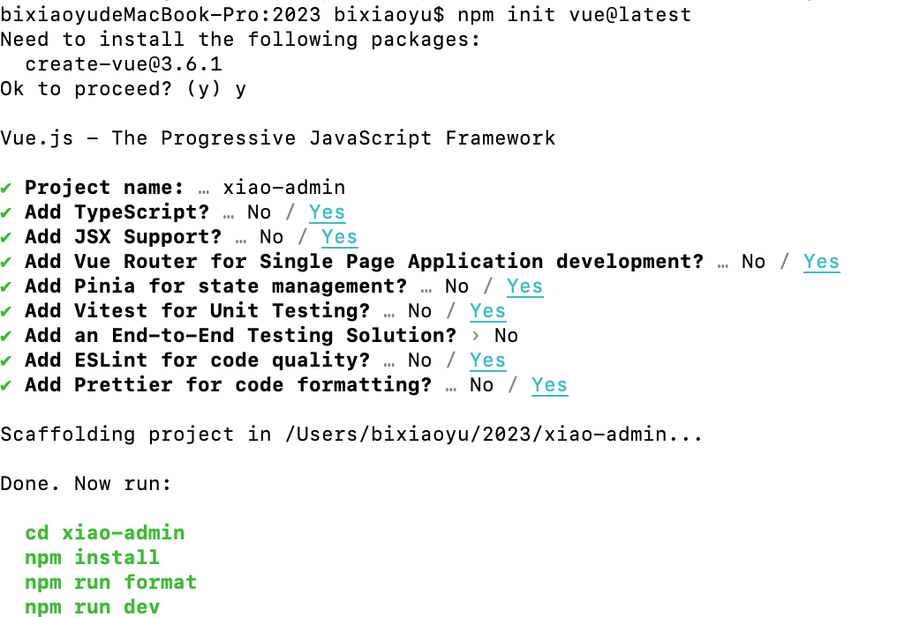

# 4.1 如何初始化一个vue3 项目
 初始化 ,node 需要安装最新稳定版.目前版本v18.14.1.node版本管理 mac可以使用n,windows使用nvm进行版本切换.
 ### 初始化 项目 npm init vue@latest
 

 Project name 输入项目名称,如直接回车 会默认值,Add TypeScript 是否添加ts,Add JSX Support 是否添加jsx的支持,Add Vue Router for Single Page Application development? 是否添加单页应用路由.Add Pinia for state management? 是否添加状态管理插件,相当于vue2 里的vuex.Add Vitest for Unit Testing? 是否添加vitest测试,是vitest是官方提供的.Add an End-to-End Testing Solution?  是否添加端到端测试解决方案.Add ESLint for code quality? 是否添加eslint.Add Prettier for code formatting?  是否添加Prettier 用作代码格式化.

 ### 
